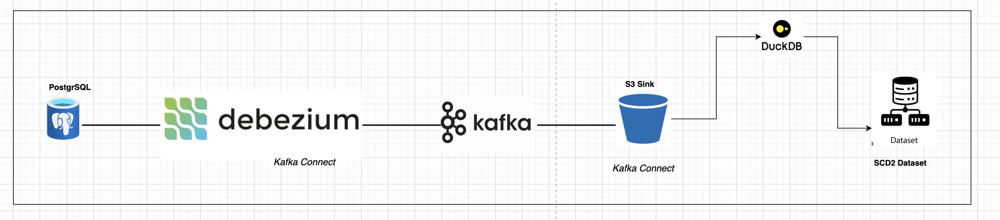
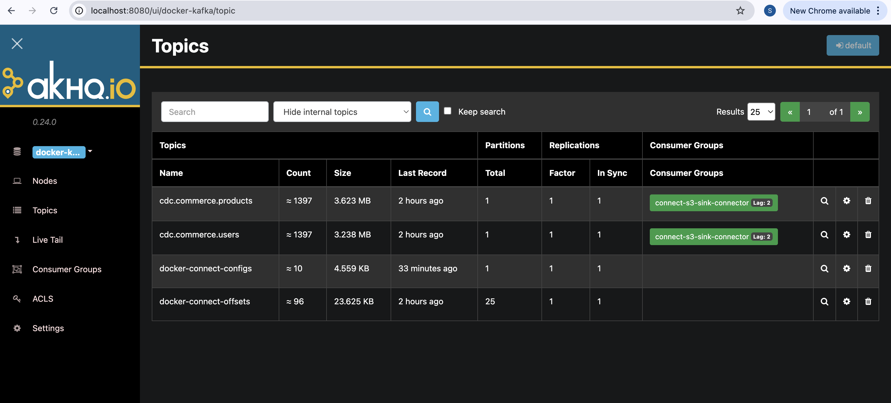
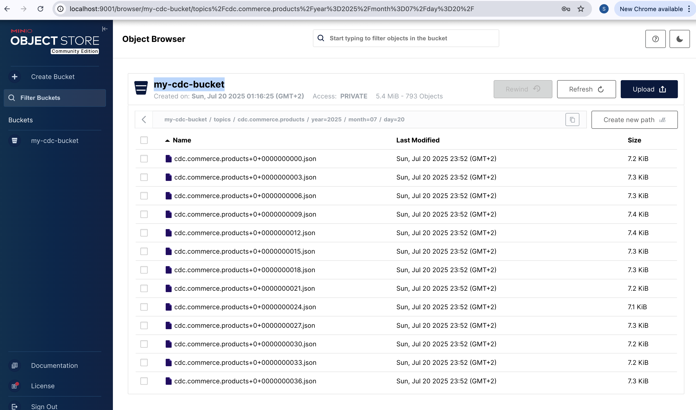

# Postgres CDC Pipeline with Kafka, S3, and DuckDB

## Objective
Capture every change to the `commerce.products` and `commerce.users` tables in a Postgres database and make it available for analytics.

---

## Tools
 - Postgres: Source DB (commerce.products and commerce.users)
 - Debezium: Captures changes via logical replication
 - Kafka + Zookeeper: Event streaming platform
 - Kafka Connect: S3 Sink to store data as Parquet in MinIO
 - MinIO: S3-compatible object storage
 - DuckDB: Query S3 data & create SCD2 tables
 - Data Generator: Inserts, updates, deletes in Postgres


## Architecture Diagram


## High-Level Architecture
- **Source Database:** PostgreSQL (`commerce.products`, `commerce.users`)
- **CDC Capture:** Debezium (via Kafka Connect source connector)
- **Message Broker:** Apache Kafka  
  - One topic per table (e.g., `cdc.commerce.products`, `cdc.commerce.users`)
- **Downstream Sink:** Kafka Connect S3 Sink Connector  
  - Writes JSON/Avro/Parquet data to S3 bucket  
  - Table-specific prefixes (e.g., `s3://bucket/products/`, `s3://bucket/users/`)
- **Analytics Layer:** DuckDB  
  - Reads data from S3  
  - Applies Slowly Changing Dimension Type 2 (SCD2) logic for historical tracking.

---

## 1. Setup Postgres with Logical Replication
*(Add your Postgres logical replication setup steps here)*

---

## 2. Deploy Kafka + Debezium Connectors
- Run Kafka cluster (Zookeeper, Kafka broker).
- Run Kafka Connect with Debezium Postgres Connector.

**Example Debezium connector config (`postgres-source.json`):**
```json
    "name": "cdc-postgres-source",
    "config": {
      "connector.class": "io.debezium.connector.postgresql.PostgresConnector",
      "tasks.max": "1",
      "plugin.name": "pgoutput",
      "database.hostname": "postgres",
      "database.port": "5432",
      "database.user": "cdc_user",
      "database.password": "cdc_password",
      "database.dbname": "commerce_db",
      "database.server.name": "cdc",
      "schema.include.list": "commerce",
      "table.include.list": "commerce.products,commerce.users",
      "slot.name": "cdc_slot",
      "publication.name": "cdc_publication",
      "snapshot.mode": "initial",
      "tombstones.on.delete": "false",
      "include.schema.changes": "false",
      "topic.prefix": "cdc",
      "decimal.handling.mode": "double"
    }
  }
  ```

---

## 3. Configure Kafka Connect S3 Sink
- Install the S3 sink connector (Confluent or open-source).
- Example config (`s3-sink.json`):

```json
{
    "name": "s3-sink-connector",
    "config": {
      "connector.class": "io.confluent.connect.s3.S3SinkConnector",
      "tasks.max": "1",
      "topics": "cdc.commerce.products,cdc.commerce.users",
      "s3.bucket.name": "my-cdc-bucket",
      "s3.region": "us-east-1",
      "store.url": "http://minio:9000",
      "aws.access.key.id": "minioadmin",
      "aws.secret.access.key": "minioadmin",
      "s3.signing.method": "AWS4-HMAC-SHA256",
      "path.style.access": "true",
      "storage.class": "io.confluent.connect.s3.storage.S3Storage",
      "format.class": "io.confluent.connect.s3.format.json.JsonFormat",
      "key.converter": "org.apache.kafka.connect.json.JsonConverter",
      "key.converter.schemas.enable": "false",
      "value.converter": "org.apache.kafka.connect.json.JsonConverter",
      "value.converter.schemas.enable": "false",
      "partitioner.class": "io.confluent.connect.storage.partitioner.DailyPartitioner",
      "path.format": "'year'=YYYY/'month'=MM/'day'=dd",
      "s3.compression.type": "gzip",
      "s3.part.size": "5242880",
      "schema.compatibility": "NONE",
      "flush.size": "3",
      "locale": "en-US",
      "timezone": "UTC"
    }
  }```


## Resulting S3 paths

```plaintext
s3://my-cdc-bucket/topics/cdc.commerce.products/...
s3://my-cdc-bucket/topics/cdc.commerce.users/...
```
---

## 4. Read Data from S3 with DuckDB
- DuckDB supports reading Parquet/CSV files directly from S3.


## 5. Apply SCD2 Logic in DuckDB

Assuming your CDC data includes:
```
- `op` or `__op` (insert/update/delete indicator)
- `ts_ms` (change timestamp)
- Primary key (`id`)
```

**SCD2 Approach**
```
- Maintain `effective_from`, `effective_to`, and `is_current` columns.
- On update:
  - Close old record (`effective_to = ts_ms`, `is_current = false`)
  - Insert new row with `effective_from = ts_ms`
```

## 🌐 Web UIs

The following web UIs are available for monitoring and interacting with the project components:

## Web UIs

| Service        | URL                                         | Username        | Password        |
|----------------|--------------------------------------------|-----------------|-----------------|
| Kafka (AKHQ)   | [http://localhost:8080](http://localhost:8080) | `not required` | `not required` |
| PgAdmin        | [http://localhost:8082](http://localhost:8082) | `pgadmin@local` | `admin`         |
| MinIO          | [http://localhost:9001](http://localhost:9001) | `minioadmin`    | `minioadmin`    |

--

### PgAdmin Database Connection Details

To create a new database connection in **PgAdmin**, use the following parameters:

| Parameter      | Value         |
|----------------|---------------|
| Hostname       | `postgres`    |
| Port           | `5432`        |
| Database Name  | `commerce_db` |
| Username       | `cdc_user`    |
| Password       | `cdc_password` |

--

## Docker Components

| Component         | Image                                  | Port(s) Exposed     | Description                                    |
|-------------------|---------------------------------------|---------------------|------------------------------------------------|
| PostgreSQL        | `postgres:14`                         | `5432`              | Source database for CDC                        |
| Kafka Broker      | `confluentinc/cp-kafka:7.0.1`          | `9092`              | Kafka broker to stream CDC events              |
| Zookeeper         | `confluentinc/cp-zookeeper:7.0.1`      | `2181`              | Coordinates Kafka brokers                      |
| Kafka Connect     | `confluentinc/cp-kafka-connect:7.0.1`  | `8083`              | Runs Debezium and S3 Sink connectors           |
| Debezium Connector| `debezium/connect:2.3`                | (inside Kafka Connect) | Captures CDC events from Postgres           |
| AKHQ (Kafka UI)   | `tchiotludo/akhq:latest`              | `8080`              | Web UI for Kafka topic monitoring              |
| PgAdmin           | `dpage/pgadmin4:latest`               | `8082`              | Web UI for Postgres                            |
| MinIO             | `minio/minio:latest`                  | `9000, 9001`        | S3-compatible storage                          |


## Startup Steps

Follow these steps to start the entire data pipeline:

1. **Clone the repository**
   ```bash
   git clone https://github.com/change-data-capture-poc.git
   cd change-data-capture-poc
   ```

2. **Start Docker Containers**
    - Ensure you have Docker and Docker Compose installed.
    - Run the following command:
    ```bash
    docker-compose up -d

3. **Verify Services**
  - Access the Kafka UI (AKHQ): http://localhost:8080
  - Access PgAdmin: http://localhost:8082
  - Access MinIO: http://localhost:9001

  





4. **Configure PgAdmin**


- Can also check these queries:

```sql 
SELECT * FROM pg_replication_slots WHERE slot_name = 'cdc_slot';
SELECT * FROM pg_publication;
SELECT * FROM pg_publication_tables WHERE pubname = 'cdc_publication';

INSERT INTO commerce.products (id, name, description, price) 
VALUES (1, 'Sample Product', 'This is a sample product description', 19.99);

INSERT INTO commerce.users (id, username, password) 
VALUES (1, 'testuser', 'password123');
```

5. **Deploy Kafka Connectors**
    - Register the Debezium Connector:
    ```bash
    curl -X POST -H "Content-Type: application/json" \
--data @connectors/postgres-source.json \
http://localhost:8083/connectors 
```

6. **Register the S3 Sink Connector**

```bash
curl -X POST -H "Content-Type: application/json" \
--data @connectors/s3-sink.json \
http://localhost:8083/connectors
```

7.  **Check S3 Data**

8. **Analyze data with duckDB**
##Access the data in minio via S3 API

- Now let's create a SCD2 for products table from the data we have in minio. Note we are only looking at rows that have updates and deletes in them (see the where id in filter in the below query).

```sql
import duckdb

# Create or connect to DuckDB database file
conn = duckdb.connect('/analytics/products_scd2.duckdb')
conn.execute("INSTALL httpfs")
conn.execute("LOAD httpfs")
conn.execute("SET s3_region='us-east-1'")
conn.execute("SET s3_url_style='path'")
conn.execute("SET s3_access_key_id='minioadmin'")
conn.execute("SET s3_secret_access_key='minioadmin'")
conn.execute("SET s3_endpoint='minio:9000'")  # your MinIO endpoint
conn.execute("SET s3_use_ssl=false")

conn.execute("""
CREATE OR REPLACE TABLE products_scd2 AS
WITH products_create_update_delete AS (
    SELECT
        COALESCE(
            CAST(json->'value'->'after'->'id' AS INT),
            CAST(json->'value'->'before'->'id' AS INT)
        ) AS id,
        json->'value'->'before' AS before_row_value,
        json->'value'->'after' AS after_row_value,
        CASE
            WHEN CAST(json->'value'->'$.op' AS CHAR(1)) = '"c"' THEN 'CREATE'
            WHEN CAST(json->'value'->'$.op' AS CHAR(1)) = '"d"' THEN 'DELETE'
            WHEN CAST(json->'value'->'$.op' AS CHAR(1)) = '"u"' THEN 'UPDATE'
            WHEN CAST(json->'value'->'$.op' AS CHAR(1)) = '"r"' THEN 'SNAPSHOT'
            ELSE 'INVALID'
        END AS operation_type,
        CAST(json->'value'->'source'->'lsn' AS BIGINT) AS log_seq_num,
        epoch_ms(CAST(json->'value'->'source'->'ts_ms' AS BIGINT)) AS source_timestamp
    FROM
        read_ndjson_objects('s3://my-cdc-bucket/topics/cdc.commerce.products/*/*/*/*.json')
    WHERE
        log_seq_num IS NOT NULL
)
SELECT
    id,
    CAST(after_row_value->'name' AS VARCHAR(255)) AS name,
    CAST(after_row_value->'description' AS TEXT) AS description,
    CAST(after_row_value->'price' AS NUMERIC(10, 2)) AS price,
    source_timestamp AS row_valid_start_timestamp,
    COALESCE(
        LEAD(source_timestamp) OVER (PARTITION BY id ORDER BY log_seq_num),
        CAST('9999-01-01' AS TIMESTAMP)
    ) AS row_valid_expiration_timestamp
FROM
    products_create_update_delete
WHERE
    id IN (
        SELECT id
        FROM products_create_update_delete
        GROUP BY id
        HAVING COUNT(*) > 1
    )
ORDER BY
    id, row_valid_start_timestamp
""")

print("SCD2 transformation completed and saved to products_scd2.duckdb")

conn.close()
```


